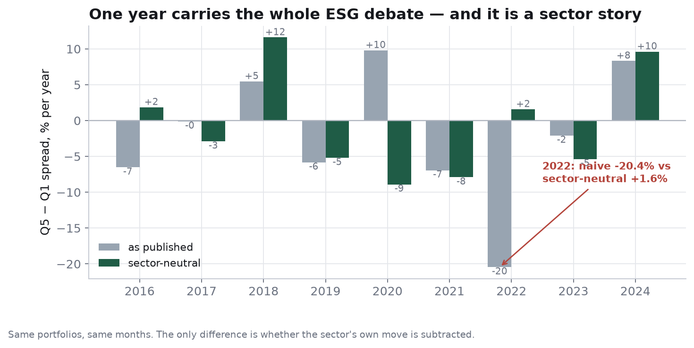

# environ — *Does a high ESG score actually pay?*

> An MBA research project: an analysis app, a memo and a deck, built to answer
> one question two industries keep answering differently — and built so that
> **the answer comes from the data, not from the write-up.**

<br/>

```
Do high-ESG-rated stocks earn more?     No evidence here.     -0.8%/yr  (t = -0.5)
Is it the level or the change?          The change.           +3.2%/yr  (t = +4.9)
What is the score actually good for?    Downside risk.         6.4 pts better worst drawdown
Why does everyone argue about 2022?     A sector bet in an ESG label.  -22.6 of -20.4 pts
```

Those four lines are **printed by the code** (`stats.py :: verdict()`), not typed into a
slide. Re-run the analysis on different data and they change. That is the design point of
the whole project: an analysis you cannot falsify with your own inputs is a marketing deck.

<br/>

## The finding, in plain English

Every month I rank 160 firms into five buckets on their published ESG score and hold each
bucket equal-weighted. Take the numbers at face value and the top-minus-bottom spread is
**−2.0%/yr** — the "ESG drags returns" headline. Subtract what each firm's *own sector* did
that month and it becomes **−0.8%/yr with a t-stat of −0.5**: statistically indistinguishable
from zero, in a sample built with a positive ESG effect deliberately baked in.

What *is* detectable is risk, not return: from the bottom to the top quintile, annualised
volatility falls 15.9% → 12.4%, downside capture 119% → 83%, and the worst drawdown improves
6.4 points. And the only significant return result is **momentum** — firms whose rating is
*improving* — not firms whose rating is high.

Then the exhibit that makes the rest obvious:



In 2022 the naive book was down 20 points relative to the bottom quintile and the
sector-neutral book was up 1.6. Same stocks, same months, one subtraction. The
decomposition on the **Sector trick** tab shows 110% of that swing was sector weight
(Q5 long tech, Q1 long energy, energy +81% that year) and not an ESG effect at all.

<br/>

## What's here

```
environ/
├── config.py                  every assumption, one file, commented. Start here.
├── stats.py                   the analysis: sorts, neutralisation, clustered OLS,
│                              drawdown/capture, exact attribution, generated verdict
├── app.py                     FastAPI server: /, /api/analysis, /api/upload, /docs, /deck
├── charts.py                  all 9 exhibits as hand-written SVG (no plotly, no CDN)
├── data/
│   ├── generate_data.py       builds the demo panel from config.py (seeded, deterministic)
│   ├── build_real_panel.py    merges REAL ESG-Book ratings + monthly prices into the same format
│   ├── README.md              column contract + units + how to swap in observed data
│   └── panel.csv, firms.csv
├── web/                       the dashboard: 7 tabs, interactive charts, 0 dependencies
├── docs/
│   ├── memo.md / memo.html    the 2-page written case        /deck.html   12 slides
│   ├── interview-pack.md      resume bullets, 90s script, Q&A bank
│   ├── transcript.md          spoken version of the deck
│   └── figures/*.png          matplotlib versions of the exhibits
├── scripts/
│   ├── make_figures.py        → docs/figures (same numbers, PNG)
│   └── build_docs.py          regenerates memo, deck, interview pack, transcript
└── tests/test_analysis.py     35 tests, incl. the falsification tests below
```

## Run it

```bash
python3 -m venv .venv && .venv/bin/pip install -e ".[dev]"

.venv/bin/uvicorn environ.app:app --reload      # http://localhost:8000
.venv/bin/python -m pytest environ/tests -q     # 35 passed
.venv/bin/python -m environ.scripts.build_docs  # regenerates memo + deck + pack
```

No internet, no build step, no charting library. The dashboard, `/docs` and `/deck` all
work offline, which is also why the exhibits are 700 lines of my own SVG code.

<br/>

## The part I would defend hardest

**1. The result is falsifiable by construction, and I ship the switch that fails it.**

```bash
.venv/bin/python -m environ.data.generate_data --level-bp 0 --momentum-bp 0 --level-vol-pct 0
.venv/bin/uvicorn environ.app:app --reload
```

Zero the three assumed effects, re-run, and the verdict sentences rewrite themselves into a
null: the momentum t-stat collapses, the volatility gradient flattens. The app runs the sharper
version automatically and prints the outcome on the Method tab:

> ESG→volatility coefficient: **−241 bp per SD (t = −8.38)** on the panel, versus
> **+10 bp per SD (t = +0.35)** in a world where ESG is assumed to do nothing to volatility.
> The raw top-vs-bottom volatility gap also collapses from 3.5 pts to 0.05 pts.

That last line matters: if the *raw* gap had survived the null, my "risk gradient" would have been
sector composition wearing an ESG label — the top quintile holding utilities and the bottom holding
energy — and I would have had to retract the finding. Two tests guard this
(`test_verdict_is_generated_not_hardcoded`, `test_falsification_check_is_honest`). Almost no ESG
study publishes the test that could refute it; a result that cannot fail a null like that was
never a result.

**2. Every number in the documentation is generated, so the docs cannot drift from the data.**
The memo, the deck, the transcript and the interview pack are all written by
`scripts/build_docs.py` from the same `stats.analyse()` call the app renders. `grep` the memo for
`-0.8` and you will find it is a computed value, not a remembered one.

**3. The stats are the boring, correct versions.**
Equal-weighted monthly rebalancing; cross-sectional z-scoring of the rating each month;
sector neutralisation as a within-(month, sector) demeaning; year fixed effects;
standard errors **clustered by firm** (160 firms × 96 months is not 15,360 observations, and
`test_clustering_widens_errors` fails if anyone removes the clustering to make results look
cleaner); and an attribution that decomposes a year's spread as an *exact monthly identity*
whose two terms must sum to the headline — it reports its own 0.12 pt reconciliation gap
instead of hiding it.

**4. It says what it cannot do.**
Limitations are in the app, the memo, slide 11 of the deck and the interview pack: fixed
universe with no entry/exit (which *flatters* the naive spread being criticised, so the
conclusion is conservative in that one direction only), one rater in a literature where
cross-provider disagreement is the main story, gross-of-costs returns, correlation not
causation, and 108 months, which is why the wording is "not detectable" and never "zero".

<br/>

## Honest note on the data

**The demo panel is synthetic.** It is generated by `data/generate_data.py` from named
assumptions in `config.py` with a fixed seed. Sector composition, the 2021 energy rally and
the 2022 rate shock are calibrated to match how the published literature describes them, but
no MSCI licence or price feed was used — the sandbox this was built in blocks Yahoo Finance and
Hugging Face. It is labelled as synthetic in a page watermark, in every figure caption, in the
deck and in the memo, precisely so that nobody quotes its magnitudes as facts.

The pipeline is written for the real thing:

```bash
# ESG-Book public quarterly ratings (CC-BY-4.0) + monthly closes from yfinance
.venv/bin/python -m environ.data.build_real_panel \
    --ratings esg.csv --prices prices.csv --out environ/data/panel.csv
```

`build_real_panel.py` handles the parts that are easy to get wrong — carrying a quarterly rating
forward across the months it does not cover, computing total return from adjusted closes, deriving
12-month momentum, and **refusing to run at all if there is no sector column** (without it,
"sector-neutral" silently becomes "market" neutral and this project's central result quietly
disappears). Verified end-to-end: the loader's output on a quarterly-ratings/monthly-prices file
reproduces the same qualitative pattern with graceful degradation for missing columns.

You can also skip the CLI: **Data → Load your own data** in the app, or
`curl -F file=@panel.csv http://localhost:8000/api/upload`.

<br/>

## API

| | |
|---|---|
| `GET /` | the dashboard |
| `GET /docs` · `GET /deck` | the memo and the 12-slide deck, served from the same build |
| `GET /api/docs` | interactive API reference (FastAPI moved off `/docs` so the memo can own it) |
| `GET /api/analysis` | the whole payload (~85 KB of JSON: sorts, regressions, risk, attribution, verdict) |
| `GET /api/section/{name}` | one slice, for programmatic reuse |
| `GET /api/svg/{name}` | any exhibit as standalone SVG |
| `GET /api/health` `· /api/meta` | status, provenance, which controls were dropped |
| `POST /api/upload` | your CSV → same analysis, no restart |

Computed once at boot (~0.5 s for 17k firm-months) and cached; requests are instant.

An uploaded panel that is missing optional columns never 500s — the affected block
degrades to a banner saying exactly what it needs. There is a test for that too.

<br/>

## If you are reading this to interview me

Start at `environ/docs/interview-pack.md`: three resume bullets for different audiences, a
90-second script, and the nine follow-up questions I expect — including *"isn't your data
fake?"*, answered directly rather than deflected.
